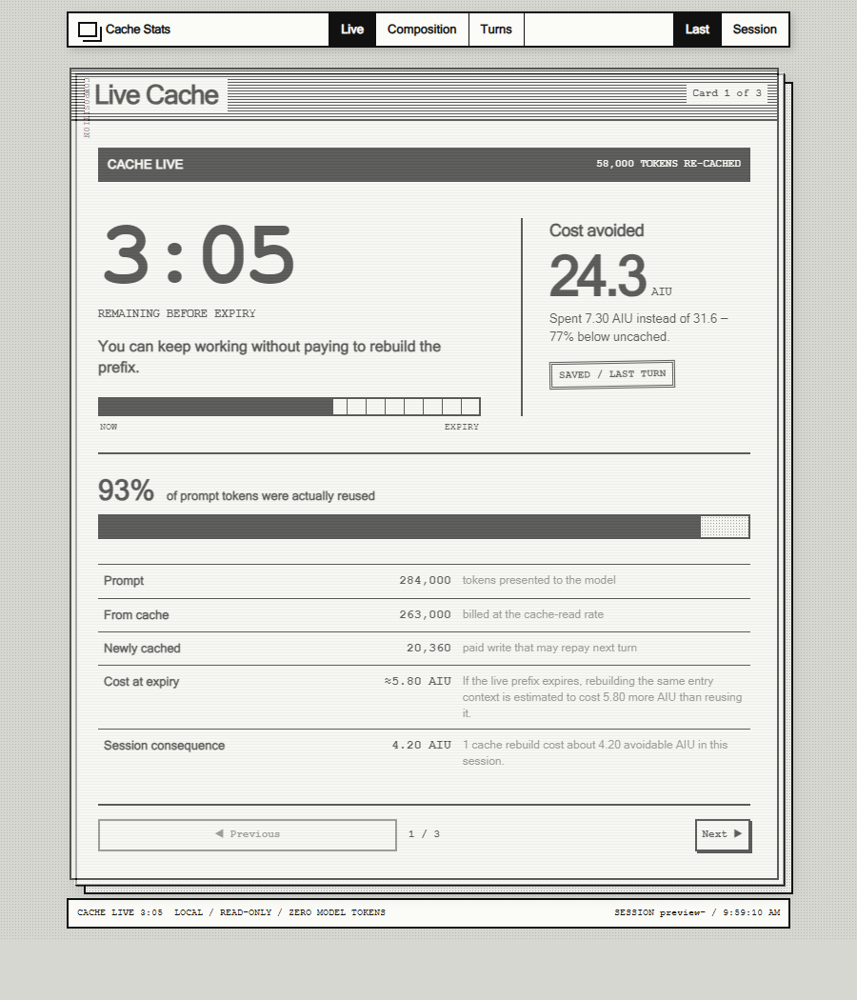

# Cache Stats

A local-first GitHub Copilot canvas for understanding prompt-cache reuse, expiry,
token composition, and AIU cost while a session is still active.



> Preview data is illustrative and does not contain session information.

The one-bit HyperCard stack has three focused views:

- **Live Cache** shows expiry state, reuse, and the cost exposed if the reusable
  prompt prefix must be rebuilt.
- **Composition** separates fresh input, cache reads, cache writes, output, and
  reasoning tokens.
- **Turn History** makes cold starts and rebuild costs visible turn by turn.

The canvas refreshes locally every two seconds. Opening and using it consumes no
model tokens.

## Install

In a GitHub Copilot session, ask:

> Install this extension: https://github.com/arafattehsin/cache-stats-extension

Then ask:

> Open the cache stats canvas

Before marketplace approval, install the public repository directly:

```shell
copilot plugin install arafattehsin/cache-stats-extension
```

After marketplace approval, install it from Awesome Copilot:

```shell
copilot plugin install cache-stats@awesome-copilot
```

## Requirements

- A GitHub Copilot client with canvas-extension support
- A Node.js runtime with the built-in `node:sqlite` module
- A local Copilot session store containing `assistant_usage_events`

## Privacy

Cache Stats reads `~/.copilot/session-store.db` in read-only mode and serves the
canvas from an ephemeral `127.0.0.1` port. It does not modify the session store,
call a model, load remote assets, or send telemetry.

The local canvas API includes the active session ID and database path in its
response for diagnostics. That endpoint is available only through the loopback
server created for the open canvas instance.

## How the numbers work

`input_tokens` is the complete prompt for one model call:

```text
fresh input = input_tokens - cache_read_tokens - cache_write_tokens
```

Per-token billing rates come from each row's `token_details_json`, so baseline
cost, actual cost, savings, and rebuild exposure follow the model that served
the call instead of relying on hard-coded prices.

A turn starts with one user-initiated call and includes its agent, sub-agent,
and compaction follow-ups. A turn is marked `REBUILT` when its entry call reads
no cached prefix but writes a substantial one. Live expiry comes from Copilot's
`session.usage_checkpoint` event.

## Development

```shell
npm install
npm run check
copilot plugin install .
```

Reinstall the local plugin after changing source files because Copilot caches
installed plugin content.

## Package layout

| Path | Role |
| --- | --- |
| `plugin.json` | Agent Plugins v1 manifest and Copilot catalog metadata |
| `copilot-extension.json` | Direct canvas-extension install metadata |
| `extension.mjs` | Direct-install bridge to the packaged extension |
| `com.github.copilot/extensions/cache-stats/` | Spec-namespaced canvas extension package |
| `assets/preview.png` | Anonymized catalog preview |
| `scripts/` | Package and embedded-UI checks |
| `docs/PUBLISHING.md` | Public release and Awesome Copilot submission guide |

## Environment overrides

- `COPILOT_CACHE_STATS_DB` - explicit path to the session store
- `COPILOT_HOME` - alternate Copilot home directory

## License

[MIT](LICENSE)
